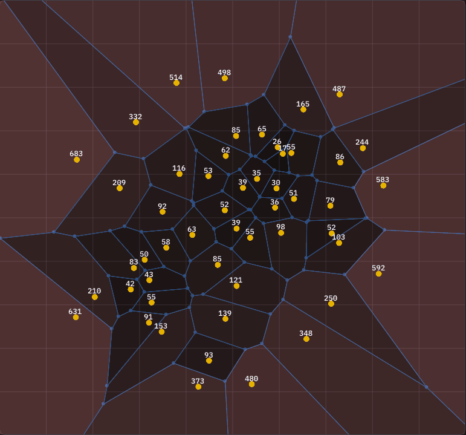

# Final project for my Computational Geometry class
What it does is show you how many *people* live next to a given *public utility building*, so that you can decide where a new one should be built.

The code works (sometimes). 
**More in the [Computational Geometry](https://github.com/AndyFilter/Geometria-Obliczeniowa) repo.**

I chose to make these two repos separate because this one was a *team* project while all the other subprojects were done solo.